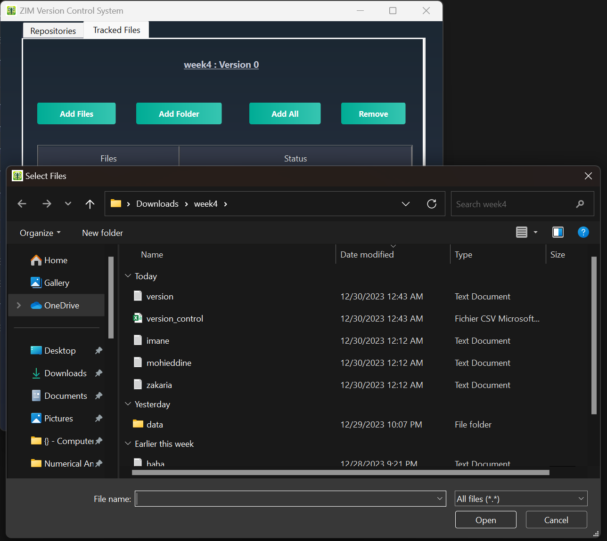

# ZIM Version Control System (ZIM-VCS)

ZIM-VCS, short for Zakaria-Imane-Mohieddine VCS, is a lightweight, user-friendly version control system. It provides the fundamental functionalities needed for version control through an intuitive graphical user interface (GUI), making it ideal for individuals or small teams looking to manage changes to their projects efficiently.

## Table of Contents

- [Features](#features)
- [Getting Started](#getting-started)
  - [Installation](#installation)
  - [Launching the Application](#launching-the-application)
  - [Compilation](#compilation)
- [Command Line](#command-line)
- [GUI](#gui)
- [Command Functionalities](#command-functionalities)
  - [Init](#init)
  - [Add](#add)
  - [Commit](#commit)
  - [Status](#status)
- [Dependencies](#dependencies)
- [Acknowledgments](#acknowledgments)

## Features

- **Graphical User Interface (GUI):** A modern, simple interface for managing your version control needs with ease.
- **Initialize (init):** Set up your project repository with just a few clicks.
- **Remove (remove repository):** Unsets the project repository by only browsing through the file explorer.
- **Add (add):** Add files to your repository via the GUI to begin tracking changes.
- **Untrack (remove file):** No longer track an added file, or store its changes.
- **Commit (commit):** Save your changes and maintain a history of modifications with visual feedback.
- **Status (status):** Visually check the current state of your files to see any changes or updates.
- **Refresh (refresh):** Refresh the repository so all tracked files' statuses are up to date.

## Getting Started

To get started with ZIM-VCS, download the latest release from our repository and follow the installation instructions. Ensure your system meets any necessary requirements.

## Installation

1. **Download the Latest Release:** Navigate to the releases section of our repository and download the latest version of ZIM-VCS.
2. **Install the Application:** Run the installer or unzip the package and execute the application depending on the provided format.

## Launching the Application

- **Open ZIM-VCS**: Locate the ZIM-VCS application on your system and open it. Upon launching, you'll be greeted with the main interface where you can start interacting with your version control system.

## Compilation

Navigate to the source directory and run:

```bash
g++ *.cpp -o mvcsApp
```

## Command Line

While ZIM-VCS features a user-friendly graphical interface, it also supports command-line operations for those who prefer or require scriptable or terminal-based interactions. The command line interface allows for quick and direct manipulation of the version control system, providing functionalities such as initialize, add, commit, and check status.


To use ZIM-VCS from the command line, navigate to the directory where the ZIM-VCS executable is located and use the following command patterns:

- **Initialize a Repository (init):**
  ```bash
  ./mvcsApp init <path-to-repository>
  ```

  Creates the ```version_control.csv``` file in the selected repository.

- **Add a File (add):**
```bash
./mvcsApp add <path-to-file>
```
Adds a file to the repository for tracking changes. It is done by setting the old hash value of the file equal to its new hash.

- **Commit changes (commit):**
```bash
./mvcsApp commit <path-to-file>
```

Commits changes made to the specified file. In a typical version control system, you might commit all changes, but in this specific implementation, you specify which file to commit.


## GUI

Below is shown an overview of the app:


ZIM-VCS features a user-friendly graphical interface designed to make version control accessible and straightforward. Here's what you can do with it:


- **Easy Navigation:** Access all version control functionalities from a single window.
- **Interactive Feedback:** Receive visual feedback on your actions, understand file statuses, and view the history of changes.
- **Simplified Workflow:** Perform complex version control tasks with simple interactions.

## Command Functionalities

## Init

Initialize your project repository using the GUI. Simply navigate to the desired directory and set it as your repository through the interface.

Clicking on *Initialize Repository* would open the File Explorer in order for the user to select a folder to initialize and track.

For instance, let's initialize the vcsTest repository located in the folder:


The absolute path to the selected folder (vcsTest) is added to the dashboard as shown below, you may also notice the creation of a ```version_control.csv``` file in the root of the repository:


## Add

Now in order to add files to track in the desired repository, click **Select Repository > Add File**, the File Explorer window shows up. Add files to your repository through the GUI. Browse your system, select the files you want to track, and add them to your project.



## Commit

Commit your changes using the GUI. Select **Commit Changes > *The file you want to commit***. The commit works only when:

- At least one tracked file is staged.
- At least one staged file is modified before the commit.

Clicking on **Commit Changes** commits all staged files to "Up To Date".


## Status

Easily check the status of your files directly from the GUI in the **Status** column.

Cliking on **Refesh**, sets the tracked files that were modified to an **Up To Date** status, the ones not modified to a **Modified** status, whereas the untracked files' status is not modified.


## Remove

Selecting a file in the repository and then clicking on the **Remove File** button, untracks the file if it is staged (tracked), that is, the file is removed from the list of tracked files.

## Dependencies

Throughout its development, ZIM-VCS has utilized several key dependencies to enhance functionality and user experience:

- **QT Libraries**: For creating the graphical user interface and managing user interactions.
- **OpenSSL**: For ensuring secure data handling and storage.
- **FileSystem Library**: For efficient and reliable file management and operations.

Ensure you have these dependencies installed and properly configured in your development environment to compile and run ZIM-VCS successfully.

## Acknowledgments

- This project was developed as a part of the **"Foundations of Programming Languages 2"** course. It represents a collective effort, embodying the principles, techniques, and insights provided throughout the course.
- **Collaboration**: [Mohieddine Farid](https://github.com/MohiZzine), [Imane Rahali](https://github.com/imanerh) and [Zakaria El Maâchi](https://github.com/Zakaria-El-Maachi) have had a blast working on this project. Truly, it stands as a testament to our collective contributions and collaboration. Each of us has played a pivotal role in its success.
- **Professor**: Special thanks to our professor, whose guidance and expertise have been invaluable. Your commitment to fostering a deep understanding of programming languages and version control concepts has significantly enhanced our learning experience.